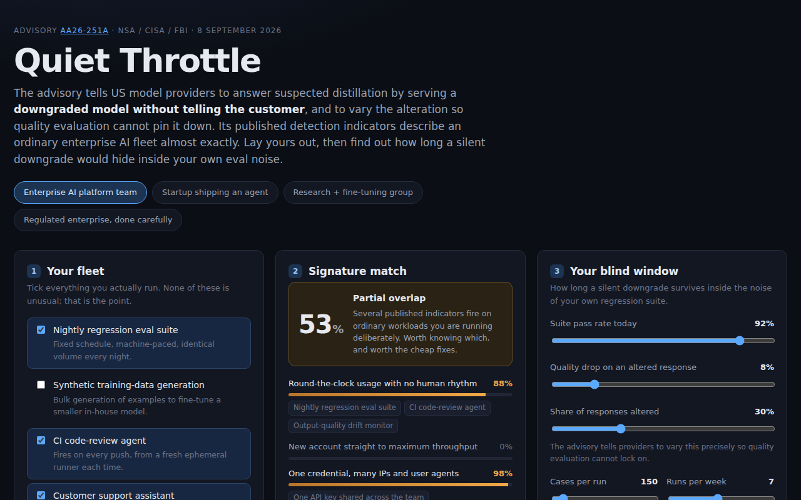

<div align="center">

# Quiet Throttle

**On 8 September 2026 the NSA, CISA and FBI told US model providers that the right answer to a suspected distillation account is to serve it a downgraded model and not say so. The detection indicators they published describe an ordinary enterprise AI fleet almost exactly. This works out how long you would not notice.**

[](https://github.com/kbipul/quiet-throttle/actions/workflows/ci.yml)
[](https://kbipul.github.io/quiet-throttle/)

`Day 030` of **[kb-daily-builds](https://github.com/kbipul/kb-daily-builds)** — one AI project a day.

</div>

## What it does

Joint advisory [AA26-251A](https://www.cisa.gov/news-events/cybersecurity-advisories/aa26-251a) names six China-based AI companies for extracting billions of tokens from Claude, GPT, Gemini and Grok, and recommends three responses. The third is the interesting one. It tells providers to leave a suspected account running and *subtly alter* what it receives: serve a less capable model, **avoid informing the user**, and vary the alteration between requests specifically so that response-quality evaluation cannot lock onto it.

Read the detection indicators from the buyer's side and they stop describing a hostile actor. Round-the-clock usage with no human variation is a nightly eval suite. One credential across many IPs and user agents is a team API key in CI. Enterprise-scale throughput on a non-enterprise plan is engineering outrunning procurement. Quiet Throttle takes a fleet of those ordinary workloads, scores it against all ten published signals, and then answers the question the countermeasure design actually raises: if a provider did quietly downgrade you, how many days would your own regression suite need before it could tell that apart from noise?

The answer is longer than it looks, because the advisory tells providers to alter only *some* responses. An 8-point quality drop applied to 30% of requests is a 2.4-point drop in your measured pass rate. A 150-case suite has about 31% power to resolve 2.4 points in any single run, so it takes seven consecutive nightly runs to be 90% sure you have seen it at all. At 90,000 requests a day, that is roughly **630,000 responses** answered by a weaker model before you could say so with confidence. Give the same downgrade to a 40-case suite run weekly, which is what a lot of teams actually have, and the window is **91 days** and 3.6 million requests.



<sub>The screenshot is captured by this repo's own CI on a GitHub runner and committed back — it appears within a few minutes of first publish.</sub>

## Try it

**[Live demo →](https://kbipul.github.io/quiet-throttle/)** — runs fully in your browser, nothing to install, nothing uploaded.

```bash
git clone https://github.com/kbipul/quiet-throttle.git
cd quiet-throttle
npm ci
npm test      # 79 tests
npm run dev   # http://localhost:5173
```

## How it works

Everything is pure functions in `src/engine/`. `signature.ts` scores the fleet, `detection.ts` computes the blind window, and `stats.ts` holds the arithmetic both of them lean on.

```
fleet config ──▶ signature.ts ──▶ 10 indicator strengths + overall match
(workloads,          │
 volume,             └─ noisy-OR over per-workload evidence,
 plan tier,             plus volume and ramp pressure derived
 credential age)        from throughput vs. plan tier

eval config ───▶ detection.ts ──▶ blind window in days
(baseline,           │
 drop,               └─ one-sided one-sample test of an observed
 intermittency,         pass rate against a known baseline;
 suite size,            normal approximation to the binomial
 cadence)
```

Indicator scoring is a noisy-OR. Each workload contributes evidence weights in `[0,1]` to the indicators it touches, and independent contributions combine as `1 - Π(1 - wᵢ)`, so two moderate sources compound into something stronger while no single indicator ever exceeds 1. Two indicators also take continuous pressure from the numeric inputs: subscription-to-usage grows logarithmically with throughput over the plan's reference volume and saturates at 8×, and no-ramp is the product of relative load and credential youth, decaying to zero at 30 days.

The blind window is a power calculation. Given a baseline pass rate `p₀` and a degradation `d` applied to a fraction `q` of responses, the observed rate is `p₁ = p₀ − dq`. Per-run power for a one-sided test at `α` with `n` cases is

```
power = Φ( (√n·(p₀−p₁) − z_α·√(p₀(1−p₀))) / √(p₁(1−p₁)) )
```

Runs until the first significant result are geometric with that success probability. The headline is the 90%-cumulative-confidence figure, `⌈ln(0.1) / ln(1 − power)⌉` runs converted to calendar days, which for the default fleet is roughly twice the first-flag expectation. The expectation is shown too, but demoted: one run crossing an α = 0.05 line at 31% power is a signal you would go and confirm, not a finding. Alongside both numbers the app gives the suite size that would settle it in one run and the size that would pull the window under two weeks.

The statistics are hand-rolled so they can be checked. `Φ` goes through the regularized lower incomplete gamma function (series below the transition point, Lentz continued fraction above) because a tool whose argument is "audit my arithmetic" should reproduce published z-values to more than six decimals. The tests pin `erf`, `Φ` and the probit to table values (`matches published values to twelve decimals`, `matches published table values to ten decimals`, `matches published critical values to eight decimals`) and pin `requiredCases` to the closed form it claims to implement.

## Build notes — what I learned

The first `erf` could not reproduce z = 1.959964 to six decimals, and my own tests said so. The implementation was Abramowitz & Stegun 7.1.26, the approximation everyone reaches for: four lines, accurate to about 1.5×10⁻⁷, which is exactly not enough. There was a real temptation to loosen the assertion and leave the implementation alone. For this project that would have been the wrong call, because the entire pitch is that the number in the box is checkable, and "checkable to five decimals because I picked a convenient approximation" is a weaker claim than it looks. The incomplete-gamma version runs to thirty lines, against four, and gets to machine precision. The pins now sit at eight decimals for the probit and ten for `Φ`.

The arithmetic corrected the headline twice, in opposite directions. I had drafted a pitch claiming a nightly suite sits blind "for weeks". The first run of the real engine said 3.6 days, and I went and rewrote the pitch. But 3.6 days was the *expected wait until the first run crosses significance*, which at 31% power and a 5% false-positive rate is a number an engineering leader would not act on: you would see one bad run, shrug, and wait for the next. The figure that means something is how long until you would be 90% sure, and that is 7 days for the default fleet and 91 days for the weekly-suite one. So an overstatement I invented became an understatement the model produced, and settled on a third number that is defensible. There is a test for the choice, `needs more runs for 90% confidence than the bare expectation`, so the demotion cannot quietly reverse.

The idea had arrived as a security story and turned into a statistics story about an hour in. My first sketch was another paste-and-score report card, the shape I have already built four times in this series and the shape my own selection rules now bar me from building again. What rescued it was one sentence in the advisory: "Vary those changes across requests to complicate response quality evaluations." That was written by someone who has thought carefully about evaluation power, and once I read it that way the build stopped being a scanner and became a calculator.

The intermittency slider is the whole product. Without it you get the naive version, "quality dropped 8 points, of course my evals will catch that", and the tool says nothing anyone did not already know. With it, the drop your suite actually sees is `d × q`, and 2.4 points is a genuinely hard thing for 150 cases to resolve.

The tenth indicator is the one I did not expect to have to write. A harness that tracks output quality per model version is the only instrument that would catch a silent downgrade, and the advisory lists "quality evaluation frameworks designed to detect defensive countermeasures" as a distiller behaviour to watch for. So the tool that defends you against indicator ten *is* indicator ten. I gave it a weight of 1, where the advisory's own enumerated detection indicators carry 3, and its mitigation field reads: "No mitigation offered, and none should be. Run the suite. Just be aware that the tool which would catch a silent downgrade is itself on the list."

What I cut: a per-day timeline chart showing the cumulative probability of detection creeping up run by run. It would have looked good and it would have been a fourth reading of the same number. The time went into the test suite instead, 65 node tests on the engine and 14 jsdom render tests, the render tests because the curl smoke test proves the server returns bytes and cannot prove the app mounts.

One losing candidate on today's slate rhymes with the piece I could not build. Recall-cliff lost for the third time, twice on demo-ability, which stays capped because an honest version needs the user's own eval data. The version of Quiet Throttle I would want with more room has the same dependency: let people paste real per-run pass rates from their own CI and fit the drop from data; the slider is a guess. That needs a file input and a change-point detector. It is the version that would be operationally useful; this one is illustrative.

Nothing here claims any provider is degrading anyone. The advisory is a recommendation to providers, and no provider publishes its thresholds. The score measures overlap with a published indicator list, and the app says so in four places; one of the render tests is called `states plainly that it is not a prediction`.

## Stack

| Layer | Choice |
|---|---|
| UI | React 18 + TypeScript 5 |
| Build | Vite 6 |
| Tests | Vitest 3 (79 tests) + Testing Library |
| Statistics | Hand-rolled — incomplete gamma `erf`, Acklam probit with a Halley refinement |
| Runtime deps | React only. No model download, no API key, no network call |

## Sources

- NSA / CISA / FBI joint advisory **AA26-251A**, *China-Based Artificial Intelligence Companies Conducting Industrial-Scale Distillation Campaigns Against U.S. AI Companies*, 8 September 2026 — [cisa.gov](https://www.cisa.gov/news-events/cybersecurity-advisories/aa26-251a)

The plan-tier reference volumes in `src/engine/signature.ts` are illustrative round numbers chosen so the subscription-to-usage indicator has a denominator. They are not any provider's published limits. Substitute your contracted figures before drawing conclusions.

## Licence

MIT © Kumar Bipul

---

<div align="center"><sub>
Built by <a href="https://www.kumarbipul.com"><b>Kumar Bipul</b></a> ·
IT Director → AI/ML · <a href="https://github.com/kbipul">github.com/kbipul</a>
</sub></div>
